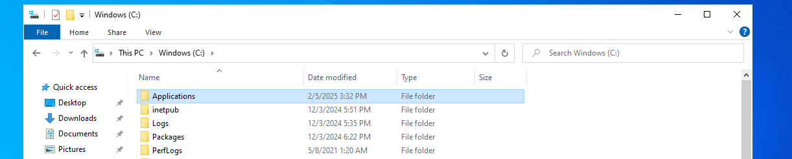

# Deploying an Application using Microsoft Configuration Manager

This documentation will show you how to successfully deploy an application using Microsoft Configuration Manager.

# Table of Contents:
1. [Getting The Installer Ready](#Getting-the-Installer-Ready)

## Getting the Installer Ready
First thing we need to do is get the MSI of the application we wish to install. For this example I will be using Microsoft Teams which can be downloaded from the link below.
- [Microsoft Teams Download](https://teams.microsoft.com/downloads/desktopurl?env=production&plat=windows&arch=x64&managedInstaller=true&download=true)

The next step in the process is to create a directory on our machine that is running MCM so that it can be accesible when we go to deploy the application. We will navigate to our `C:` drive and create a folder called `Applications`.

Next we want to create a folder called `MSTeamsMSI` inside of the `Applications` folder.

Once we have that folder created we now want to move our Microsoft Teams MSI that we downloaded earlier into the `MSTeamsMSI` folder.

