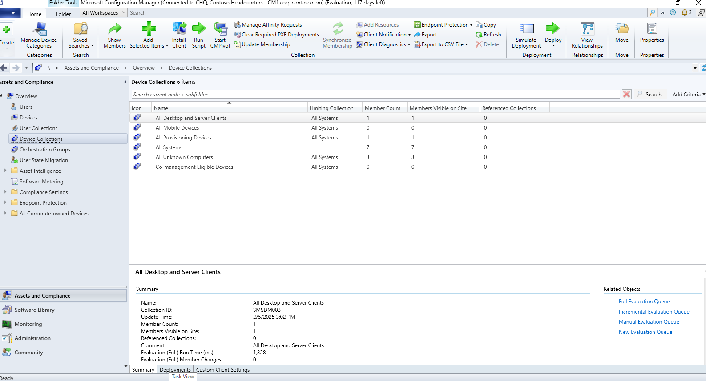
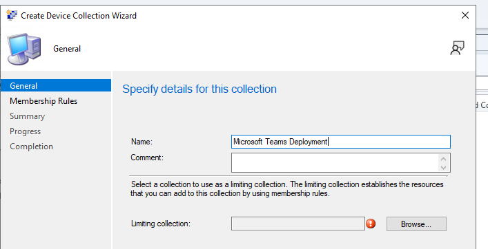
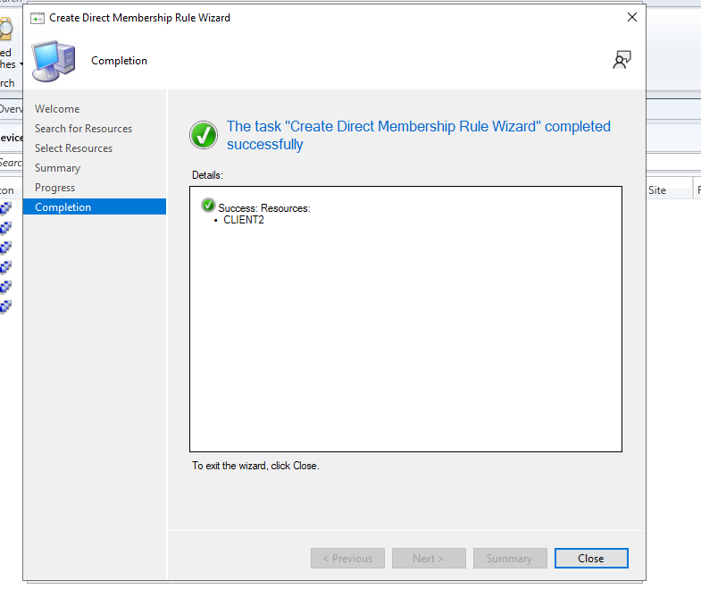
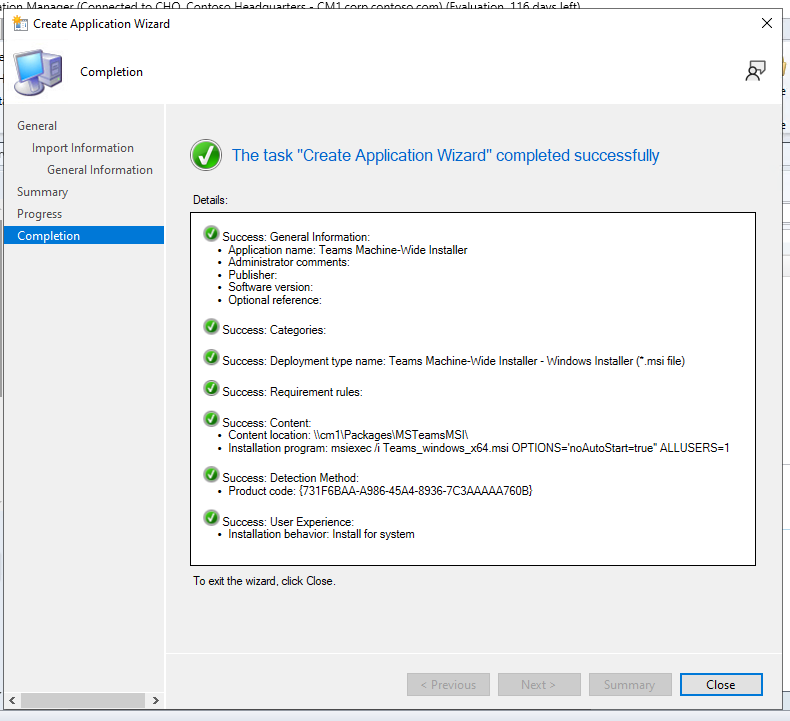

# Deploying an Application using Microsoft Configuration Manager

This documentation will show you how to successfully deploy an application using Microsoft Configuration Manager. This documentation assumes that you already have MCM and all of its dependancies already installed and running.

# Table of Contents:
1. [Getting The Installer Ready](#Getting-the-Installer-Ready)
2. [Creating the Device Collection in MCM](#Creating-the-Device-Collection-in-MCM)
3. [Adding the Application to MCM](#Adding-the-Application-to-MCM)
4. [Deploying the Application](#Deploying-the-Application)

## Getting the Installer Ready
First thing we need to do is get the MSI of the application we wish to install. For this example I will be using Microsoft Teams which can be downloaded from the link below.
- [Microsoft Teams Download](https://teams.microsoft.com/downloads/desktopurl?env=production&plat=windows&arch=x64&managedInstaller=true&download=true)

The next step in the process is to create a directory on our machine that is running MCM so that it can be accesible when we go to deploy the application. We will navigate to our `C:` drive and create a folder called `Applications`.

Next we want to create a folder called `MSTeamsMSI` inside of the `Packages` folder.

Once we have that folder created we now want to move our Microsoft Teams MSI that we downloaded earlier into the `MSTeamsMSI` folder.

## Creating the Device Collection in MCM

In MCM we want to navigate to our `Assets and Compliance` and go to `Overview` and select `Device Collections`.

We want to right click and select `Create Device Collection`.

Name the Device Collection `Microsoft Teams Deployment`.

Once we have it name we now want to click on the `Browse` button for the `Limiting Collection`. Once the window opens up we will select `All Systems` and click `Ok`.

Once that is complete click on the `Next` button to go to the `Membership Rules`. Click `Add Rule` and this will open a drop down and select `Direct Rule`.

When the Welcome screen pops up click `Next`. We can leave the default `Resource class` and `Attribute name` selections and for the `Value` field we want to put the name of the client we are wish to deploy the application to, in this case my machine is name `CLIENT2` and click `Next`.

We will see a screen that shows us the machine and we want to select it and click `Next`.

Click `Next` on the summary page and then click the `Close` button if the direct rule was created successfully.

Once we go back to the device collection adter adding the rule we can see that it is there under the `Membership rules`.

Click the `Next` button and when on the `Summary` page click `Next` again and if done successfully you will see this message.

## Adding the Application to MCM

The next step in the process is to add the application to MCM so that we can deploy it. To do this we navigate to `Software Library`
and the go to `Overview` then click on `Application Management` and select `Applications`.

We want to right click in the empty pane and click on the `Create Application` option.

The `Create Application Wizard` will open up and we need to leave it on `Automatic` and keep the type as `Windows Installer`. 
The location of the file needs to be from the folder we made earlier but it needs to be the network location it cannot be the local location. 
So for this example my application is located at `\\CM1\Packages\MSTeamsMSI\Teams_windows_x64.msi`. 

Then we hit the `Next` button and we will see that it will import the information about the package and the click `Next`.

On the `General Information` tab we want to put in some options. For the installation program we will put `msiexec /i Teams_windows_x64.msi OPTIONS='noAutoStart=true" ALLUSERS=1`\
For the install behaviour we will select `Install for System`.

Hit the `Next` button and you will go to the `Summary` tab and then click `Next` again and you will see the completion screen and then you can click `close`.

## Deploying the Application

Once we have the application created inside of MCM we can now deploy it to our machine. To do this we want to right click on our 
newly created `Teams Machine-Wide Installer` and click `Deploy`.

The `Deploy Software Wizard` should open and next we want to set the collection to the one we made earlier called `Microsoft Team Deployment` under the `Collections`.

Once that is done we click on the `Next` button and in the `Content` tab we will add the distribution point which in our case is `CM1.CORP.CONTOSO.COM`.

Once that is added we can click `Next` and go to our `Deployment Settings` tab. Once in this tab we want to change the `Purpose` to `Requried`.

After that setting is changed we can click `Next` until we see the completion screen as there are no other settings we need to change.

Once this is complete you should be able to see that applcation in `Software Center` and Microsoft Teams will Automatically install on your devices that are within the selected device collection.

