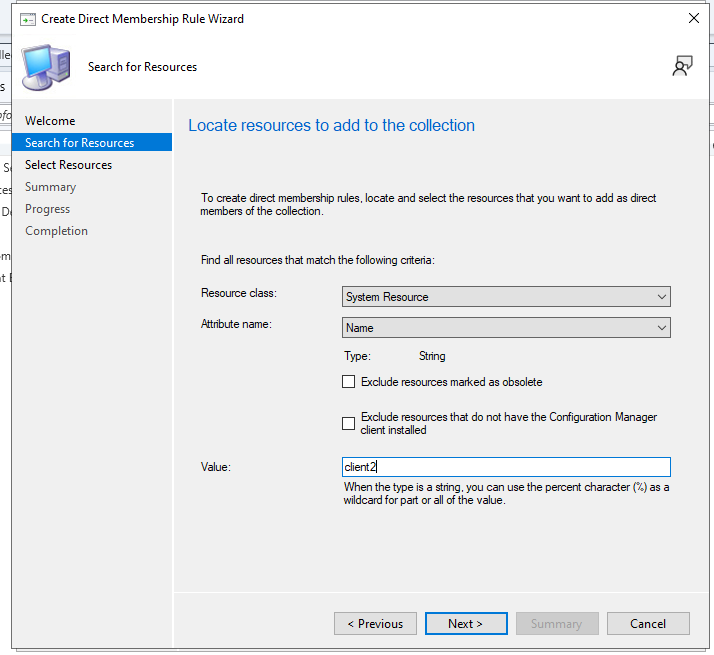

# Deploying an Application using Microsoft Configuration Manager

This documentation will show you how to successfully deploy an application using Microsoft Configuration Manager.

# Table of Contents:
1. [Getting The Installer Ready](#Getting-the-Installer-Ready)
2. [Creating the Device Collection in MCM](#Creating-the-Device-Collection-in-MCM)

## Getting the Installer Ready
First thing we need to do is get the MSI of the application we wish to install. For this example I will be using Microsoft Teams which can be downloaded from the link below.
- [Microsoft Teams Download](https://teams.microsoft.com/downloads/desktopurl?env=production&plat=windows&arch=x64&managedInstaller=true&download=true)

The next step in the process is to create a directory on our machine that is running MCM so that it can be accesible when we go to deploy the application. We will navigate to our `C:` drive and create a folder called `Applications`.

Next we want to create a folder called `MSTeamsMSI` inside of the `Applications` folder.

Once we have that folder created we now want to move our Microsoft Teams MSI that we downloaded earlier into the `MSTeamsMSI` folder.

## Creating the Device Collection in MCM

In MCM we want to navigate to our `Assets and Compliance` and go to `Overview` and select `Device Collections`.

We want to right click and select `Create Device Collection`.

Name the Device Collection `Microsoft Teams Deployment`.

Once we have it name we now want to click on the `Browse` button for the `Limiting Collection`. Once the window opens up we will select `All Systems` and click `Ok`.

Once that is complete click on the `Next` button to go to the `Membership Rules`. Click `Add Rule` and this will open a drop down and select `Direct Rule`.

When the Welcome screen pops up click `Next`. We can leave the default `Resource class` and `Attribute name` selections and for the `Value` field we want to put the name of the client we are wish to deploy the application to, in this case my machine is name `CLIENT2` and click `Next`.

